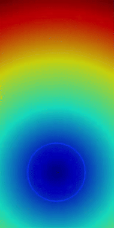
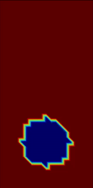

## CFD using FEM
This is a collection of CFD cases developed using [Firedrake](https://www.firedrakeproject.org/) on Google Colab. These cases are (partially) part of the program of the courses "Computational Fluid Dynamics" and "Numerical Analysis for Partial Differential Equations" held at Politecnico di Milano.

- 🫧 rising_bubble: demo to compare LS (Level Set) and VOF (Volume of fluid) methods to handle 2D free surface problems.

  
  
  
- 🌡️ multiphysics: simulation of the thermal boundary layer near a hot plate using the Boussinesq Buoyancy Model.
